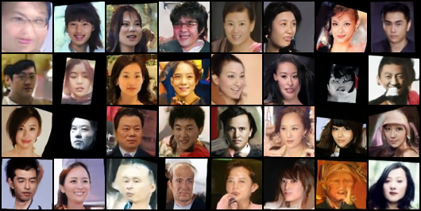

# SimpleFlowMatching

A minimal Flow Matching image generation model specialized for Asian faces, trained from scratch on a consumer GPU (10GB VRAM).

## Sample Output



*32 images generated via Euler ODE (50 steps), trained at 2M steps.*

## Overview

- **Framework**: Flow Matching (linear interpolation path, velocity prediction)
- **Architecture**: 2D UNet with spatial attention
- **Dataset**: Curated Asian face images
- **Resolution**: 64×64
- **Hardware**: Single GPU, 10GB VRAM

## Training

```bash
python script-waterhen-1-fit-data.py
```

## Inference

```bash
python inference-sample.py
```

## Evaluation

FID evaluated across checkpoints (500K → 2M steps), showing consistent improvement.

```bash
python inference-fid.py
python -m pytorch_fid output-fid/<checkpoint> <real_images_dir>
```
